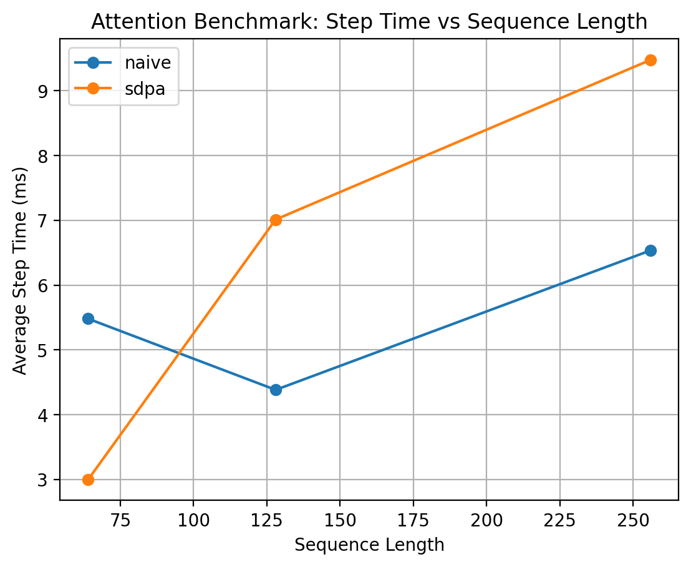
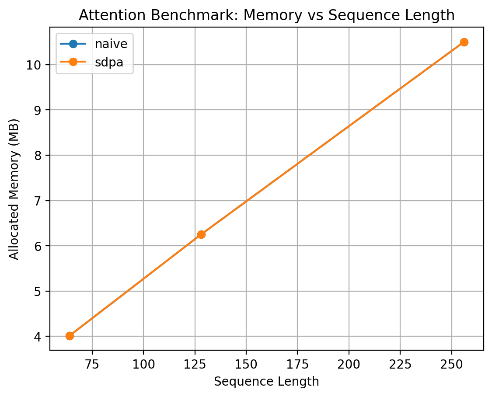

# Decoder-only Transformer Training Lab

A minimal LLaMA-style decoder-only Transformer training framework built from scratch with PyTorch.

This project focuses on the core engineering components behind large language model training:

- Transformer architecture implementation
- Causal language modeling training loop
- Attention performance benchmarking
- Training memory estimation
- Local Apple MPS experimentation

The goal is not to train a production-grade language model, but to build a compact and reproducible training-infra project that demonstrates how Transformer models are implemented, trained, profiled, and analyzed.

---

## 1. Project Highlights

### Model Architecture

This project implements a modern decoder-only Transformer with LLaMA-style components:

- Token embedding
- RMSNorm
- RoPE rotary position embedding
- Causal multi-head self-attention
- SwiGLU feed-forward network
- Residual connections
- Weight tying between token embedding and LM head
- Autoregressive text generation

### Training Infrastructure

The training loop supports:

- AdamW optimizer
- Warmup + cosine learning rate schedule
- Gradient accumulation
- Gradient clipping
- Train / validation loss evaluation
- Perplexity evaluation
- Checkpoint saving
- TensorBoard logging
- Apple MPS device support

### Performance / Infra Analysis

The project includes:

- Naive causal attention implementation
- PyTorch SDPA benchmark
- Forward + backward step-time measurement
- Tokens/s measurement
- Memory usage logging
- Analytical memory estimator for parameters, gradients, AdamW states, activations, and attention scores

---

## 2. Repository Structure

```text
decoder-transformer-training/
├── configs/
│   ├── tinystories_mps_debug.yaml
│   └── tinystories_mps_1k.yaml
│
├── data/
│   └── prepare_tinystories.py
│
├── model/
│   ├── __init__.py
│   ├── attention.py
│   ├── block.py
│   ├── rmsnorm.py
│   ├── rope.py
│   ├── swiglu.py
│   └── transformer_lm.py
│
├── scripts/
│   ├── sanity_check_model.py
│   └── plot_attention_benchmark.py
│
├── plots/
│   ├── attention_memory.png
│   ├── attention_step_time.png
│   └── attention_tokens_per_second.png
│
├── results/
│   ├── attention_benchmark_mps.csv
│   └── attention_benchmark_mps_stable.csv
│
├── benchmark_attention.py
├── generate.py
├── memory_estimator.py
├── train.py
├── environment.yml
└── README.md
```

## 3. Environment Setup

This project was developed with Conda.

```
conda env create -f environment.ymlconda activate llm-train
```

If needed, install the main dependencies manually:

```
conda create -n llm-train python=3.11 -y
conda activate llm-train
conda install -c conda-forge numpy pandas matplotlib tqdm pyyaml tensorboard ipykernel jupyter -y
conda install -c conda-forge transformers datasets tokenizers safetensors accelerate -y
python -m pip install torch torchvision torchaudio
```

Verify PyTorch and Apple MPS:

```
python - <<'PY'
import torch

print("torch version:", torch.__version__)
print("mps available:", torch.backends.mps.is_available())
PY
```

Expected local setup:

```
Python 3.11
PyTorch 2.12.0
Apple MPS available: True
```

---

## 4. Data Preparation

The project uses a subset of TinyStories tokenized with the GPT-2 tokenizer.

Prepare the dataset:

```
PYTHONPATH=. python data/prepare_tinystories.py \  
--train_samples 20000 \  
--val_samples 1000
```

This creates:

```
data/processed/tinystories/train.bin
data/processed/tinystories/val.bin
```

Local dataset statistics:

```
Train tokens: 4,466,061
Validation tokens: 194,559
Tokenizer: GPT-2 tokenizer
Vocabulary size: 50,257
```

The processed binary files are ignored by Git.

---

## 5. Model Sanity Check

Before training, run a forward / backward / generation sanity check:

```
PYTHONPATH=. python scripts/sanity_check_model.py
```

Expected behavior:

```
Using device: mps
logits shape: torch.Size([2, 64, 50257])
loss: around 10.8
backward: ok
generated token shape: torch.Size([1, 16])
sanity check passed.
```

This verifies that:

- Forward pass works
- Cross entropy loss works
- Backward pass works
- Autoregressive generation works
- MPS execution works

---

## 6. Training

Run the 1k-step TinyStories training experiment:

```
PYTHONPATH=. python train.py --config configs/tinystories_mps_1k.yaml
```

### Model Configuration

```
vocab_size: 50257
block_size: 128
n_layer: 4
n_head: 4
n_embd: 256
dropout: 0.1
parameters: 16.28M
```

### Training Configuration

```
batch_size: 8gradient_accumulation_steps: 4effective tokens per step: 8 × 128 × 4 = 4096max_steps: 1000optimizer: AdamWlearning rate: 3e-4schedule: warmup + cosine decaydevice: Apple MPS
```

### Training Result

|Step|Train Loss|Val Loss|Val Perplexity|
|---|---|---|---|
|0|10.8608|10.8569|51893.30|
|100|7.4338|7.4465|1713.92|
|200|6.0137|5.9746|393.31|
|400|5.8694|5.8942|362.92|
|600|5.7761|5.7706|320.72|
|800|5.5920|5.6501|284.33|
|1000|5.6296|5.6896|295.77|

The validation loss dropped from **10.8569** to **5.6896**, showing that the model successfully learned from the TinyStories token distribution.

Throughput was typically around:

```
~10k tokens/s on Apple MPS
```

---

## 7. TensorBoard

Start TensorBoard:

```
tensorboard --logdir runs
```

Open:

```
http://localhost:6006
```

Logged metrics include:

- train/loss
- train/lr
- train/tokens_per_second
- eval/train_loss
- eval/val_loss
- eval/val_perplexity

---

## 8. Text Generation

Generate text from a trained checkpoint:

```
PYTHONPATH=. python generate.py \  --checkpoint checkpoints/tinystories_mps_1k/final.pt \  --prompt "Once upon a time" \  --max_new_tokens 80
```

Example output after 1k steps:

```
Once upon a time you the her her the, and to. upon theI,, the.was was are and, but with. He there the and a her and a and. She They...
```

The generation quality is still weak because the model is trained from scratch with only 16.28M parameters and about 4M training tokens. The purpose of this project is to validate the training framework and infra analysis pipeline, not to train a production-ready language model.

---

## 9. Attention Benchmark

This project compares two attention implementations:

1. Naive causal attention
2. PyTorch scaled dot-product attention (SDPA)

The benchmark measures forward + backward step time using the same LLaMA-style attention module with:

- QKV projection
- RoPE
- causal masking
- output projection

Run the stable local benchmark:

```
PYTHONPATH=. python benchmark_attention.py \  --device auto \  --seq_lens 64,128,256,512 \  --batch_size 8 \  --n_embd 256 \  --n_head 4 \  --warmup 10 \  --iters 50 \  --out results/attention_benchmark_mps_stable.csv
```

### Apple MPS Stable Benchmark Result

|Device|Impl|Seq Len|Step Time|Tokens/s|Memory|
|---|---|---|---|---|---|
|MPS|naive|64|5.65 ms|90,628|4.02 MB|
|MPS|SDPA|64|6.01 ms|85,215|4.02 MB|
|MPS|naive|128|5.35 ms|191,376|6.25 MB|
|MPS|SDPA|128|5.78 ms|177,038|6.25 MB|
|MPS|naive|256|6.77 ms|302,519|11.50 MB|
|MPS|SDPA|256|7.35 ms|278,650|10.50 MB|
|MPS|naive|512|20.14 ms|203,374|25.75 MB|
|MPS|SDPA|512|17.78 ms|230,401|23.00 MB|

### Observation

On Apple MPS, SDPA does not consistently outperform naive attention at short sequence lengths. This suggests that fixed overhead and backend implementation can dominate small workloads.

However, at sequence length 512, SDPA becomes faster and uses less memory:

```
Naive: 20.14 ms, 25.75 MBSDPA:  17.78 ms, 23.00 MB
```

This indicates that optimized attention paths become more beneficial as sequence length increases.

---

## 10. Benchmark Plots

Generate benchmark plots:

```
PYTHONPATH=. python scripts/plot_attention_benchmark.py \
    --csv results/attention_benchmark_mps_stable.csv \
    --out_dir plots
```

Generated plots:

```
plots/attention_step_time.png
plots/attention_tokens_per_second.png
plots/attention_memory.png
```

### Step Time



### Tokens per Second

### Memory



---

## 11. Training Memory Estimation

The project includes an analytical memory estimator for training.

Run the estimator for the current model:

```
PYTHONPATH=. python memory_estimator.py \
    --vocab_size 50257 \
    --block_size 128 \
    --n_layer 4 \
    --n_head 4 \
    --n_embd 256 \
    --batch_size 8
```

Output:

```
Estimated parameters: 16,275,968 (16.28M)

Parameters:           62.09 MB
Gradients:            62.09 MB
AdamW states:        124.18 MB
Activations rough:     4.00 MB
Attention scores:      2.00 MB
Total rough estimate: 254.35 MB
```

### Long Context Comparison

|Block Size|Activation Memory|Attention Score Memory|Total Rough Estimate|
|---|---|---|---|
|128|4.00 MB|2.00 MB|254.35 MB|
|512|16.00 MB|32.00 MB|296.35 MB|
|1024|32.00 MB|128.00 MB|408.35 MB|

The attention score tensor scales as:

```
O(batch_size × n_head × seq_len²)
```

This is why long-context training becomes expensive even when the parameter count remains unchanged.

Note: this is a rough analytical estimate. Real training memory can be higher due to Q/K/V activations, MLP intermediate activations, logits, autograd saved tensors, framework overhead, and memory fragmentation.

---

## 12. Key Engineering Takeaways

### 1. Transformer training memory is not just parameter memory

For AdamW training, memory includes:

- Parameters
- Gradients
- Adam first moment
- Adam second moment
- Activations
- Attention scores
- Temporary tensors and framework overhead

This explains why training memory is much larger than the raw model parameter size.

### 2. Attention has a quadratic sequence-length bottleneck

The attention score matrix has shape:

```
batch_size × n_head × seq_len × seq_len
```

Therefore, attention memory grows quadratically with sequence length.

### 3. Attention backend performance depends on hardware

On Apple MPS, SDPA does not always outperform naive attention for short sequences. At longer sequence length, SDPA begins to show better step time and memory usage. This highlights the importance of benchmarking on the target hardware backend.

### 4. This project is a training-infra validation project

The purpose is to build and analyze a complete mini training stack:

```
model implementation
→ data preparation
→ training loop
→ checkpoint
→ generation
→ benchmark
→ memory analysis
```

---

## 13. How to Reproduce

### Step 1: Create environment

```
conda env create -f environment.yml
conda activate llm-train
```

### Step 2: Prepare data

```
PYTHONPATH=. python data/prepare_tinystories.py \
  --train_samples 20000 \
  --val_samples 1000
```

### Step 3: Run sanity check

```
PYTHONPATH=. python scripts/sanity_check_model.py
```

### Step 4: Train

```
PYTHONPATH=. python train.py --config configs/tinystories_mps_1k.yaml
```

### Step 5: Generate

```
PYTHONPATH=. python generate.py \
  --checkpoint checkpoints/tinystories_mps_1k/final.pt \
  --prompt "Once upon a time" \
  --max_new_tokens 80```

### Step 6: Benchmark attention

```
PYTHONPATH=. python benchmark_attention.py \
  --device auto \
  --seq_lens 64,128,256,512 \
  --batch_size 8 \
  --n_embd 256 \
  --n_head 4 \
  --warmup 10 \
  --iters 50 \
  --out results/attention_benchmark_mps_stable.csv
```

### Step 7: Plot benchmark

```
PYTHONPATH=. python scripts/plot_attention_benchmark.py \
  --csv results/attention_benchmark_mps_stable.csv \
  --out_dir plots
```

### Step 8: Estimate memory

```
PYTHONPATH=. python memory_estimator.py \
  --vocab_size 50257 \
  --block_size 1024 \
  --n_layer 4 \
  --n_head 4 \
  --n_embd 256 \
  --batch_size 8
```

---

## 14. Future Work

Potential extensions:

- Add CUDA benchmark on NVIDIA GPU
- Compare naive attention, SDPA, and torch.compile
- Add PyTorch Profiler traces
- Add FlashAttention-style tiled attention simulator
- Add mixed precision training
- Add DDP or tensor-parallel linear layer simulation
- Train a larger model or longer context version
- Add better sampling strategies for generation

---

## 15. Resume Summary

This project can be summarized as:

> Built a LLaMA-style decoder-only Transformer training framework from scratch in PyTorch, including RMSNorm, RoPE, causal self-attention, SwiGLU FFN, AdamW training pipeline, TensorBoard logging, checkpointing, and autoregressive generation. Trained a 16.28M-parameter model on TinyStories using Apple MPS, reducing validation loss from 10.86 to 5.69. Designed attention benchmarks comparing naive attention and PyTorch SDPA across sequence lengths, and implemented analytical memory estimation for parameters, gradients, AdamW states, activations, and attention score tensors